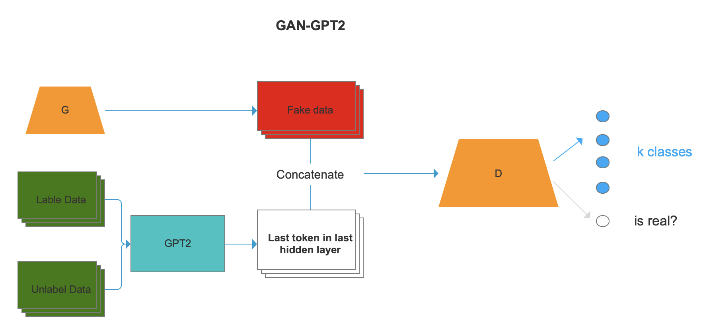
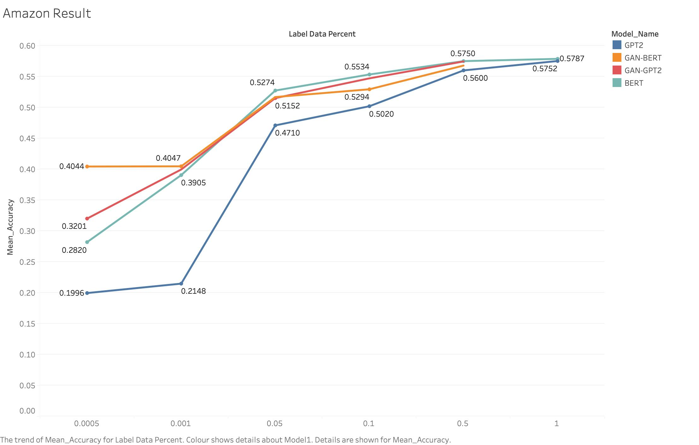
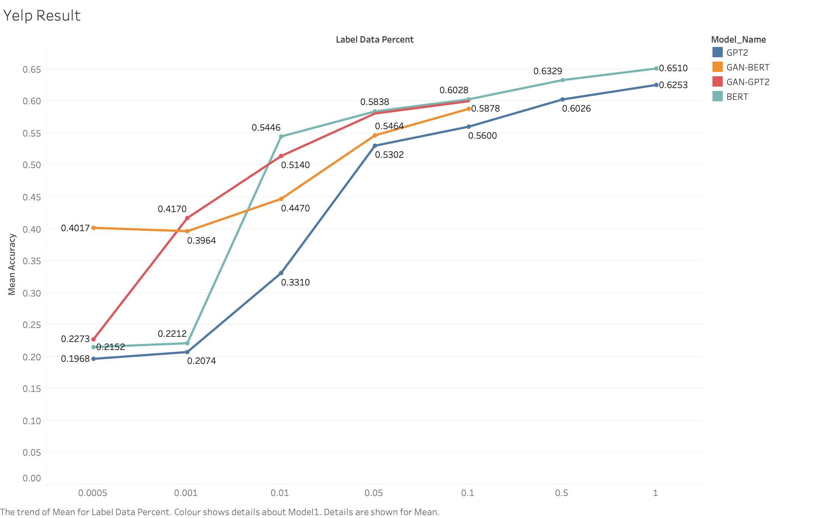
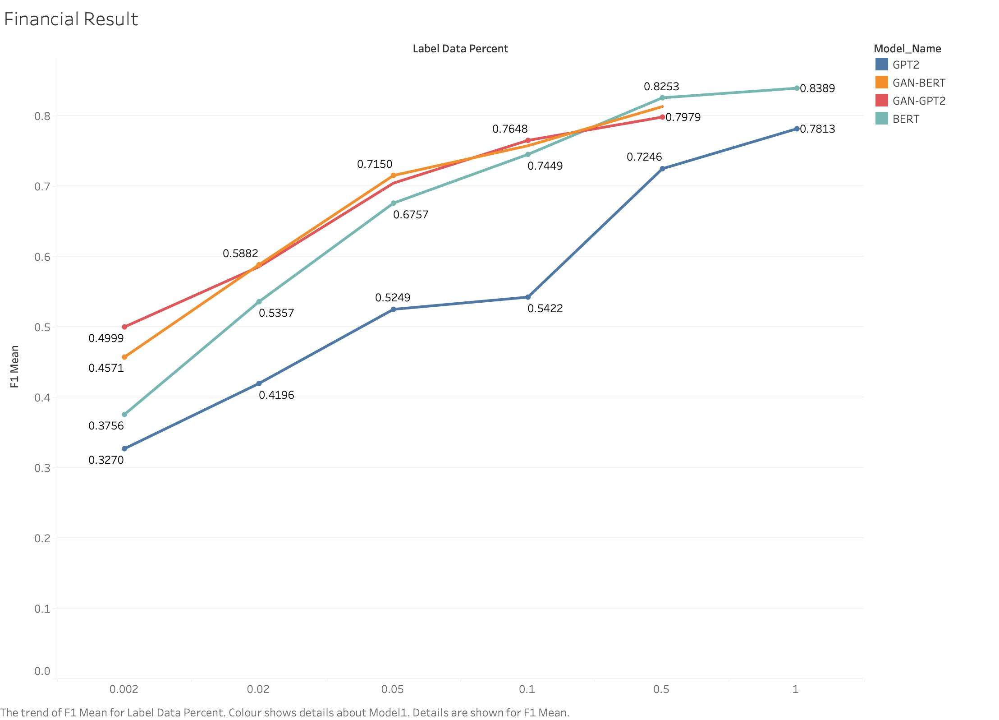

# Semi-Supervised-Text-Classification-with-Generative-Adversarial-Nets

# Background
Text classification is extremely important information for companies. Thanks to the invention of Transformer based model like Bidirectional Encoder Representations from Transformers(BERT) and Generative Pre-trained Transformer(GPT) has largely improved the performance of text classification compared to the original Recurrent Neural Network. In real business scenarios, most good performances come from millions of annotated instances, but usually, it’s impossible for some companies getting enough annotated data because it needs too much time and labour. 

Previous research has proposed GAN-BERT, which combined Generative Adversarial Nets(GAN)and BERT for training a semi-supervised model. It shows GAN could improve the performance of BERT in semi-supervised tasks. In this research, we propose the GAN-GPT2 model, which combines GAN and GPT and compares it with BERT, GPT2, and GAN-BERT in semi-supervised experiments. We want to find the possibility to leverage only 1%-5% label data to get pretty good performance to reduce the time-consuming and labour cost in real business scenarios.

# Methodology
For each model, we test it on three datasets: Amazon Review dataset, Yelp Review dataset and Financial Review dataset, with different proportions of annotated examples. The experiment result shows that GAN-BERT and GAN-GPT2 only need fewer annotated examples to get a good performance. Compared to the result of BERT and GPT training with all annotated examples, GAN-BERT and GAN-GPT2 only need 5%-10% annotated examples to get the same performance. Especially, our result shows GAN could largely improve GPT2’s performance when facing less than 10% annotated data.

# Model
Our code is compatible with the Hugging Face model and dataset. You can change to another dataset in Hugging Face. Or you can change the bert-base-model to a bigger model like Microsoft/debert-v3, etc.

GPT2 uses the decoder part of the Transformer. So we changed the model to make sure it could also work with the SS-GAN model. First, we changed the padding method from left padding, which was used in BERT, to right padding. Padding is a skill when we have different sequence lengths in our dataset. We add a special token in the sentence to make sure each sentence has the same length before training, which means our dimension of each input is the same. In BERT, they use the first token as the representation of a sentence embedding, so the padding method is right padding which means it adds a special
token to the end of the sentence. But GPT2 is different. GPT2 use the last token as the representation of a sentence embedding, so the padding method is left padding, which means it adds a special token to the beginning of the sentence.

The GPT2 model we use has 12 hidden layers, and the last hidden layers extract all of the information from 10 inputs. Under consideration of our padding method, we select the last token in the last hidden layer as the final representation of a sentence. Then we concatenate the output of the hidden layer and the fake data generated by the generator G as the input of the discriminator D. Finally, the discriminator uses the combined input to
predict. The modified structure of GAN-GPT2 is shown in the figure below.

# Result
Our test result was shown in the following figures.

# Conclusion
- Adding GAN to pre-trained models BERT and GPT2 could improve the performance when training with
few label data
- Among three experiments, GAN-GPT2 could perform as well as GAN-BERT in Amazon Review dataset
and Financial Review dataset and even could have higher accuracy in Yelp Review dataset
- GAN-GPT2 always could largely improve the performance of GPT2 until 50% of label data were used
- GAN-based transformer model could extract information from unlabeled data and could help our model
get over 90% of the benchmark(the performance of the pre-trained model trained with all label data) with
only 1% or 5% label data
- The performance divergence between the GAN-based transformer model and the original transformer model
depends on not only the proportion of label data but also the amount of label data. We could find large
divergence, especially when we only have hundreds of label data.

Thus, our model showed the capacity to reduce the 90%- 95% data annotation cost for companies with large text documents.
